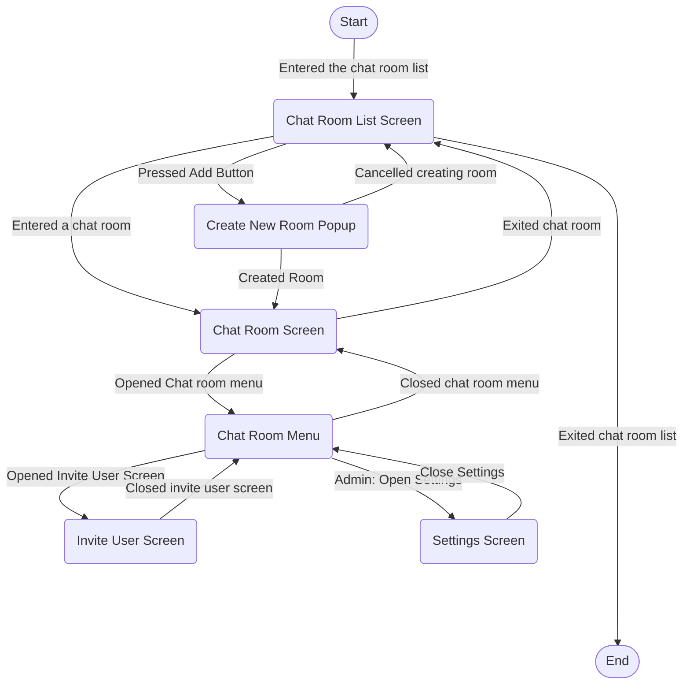
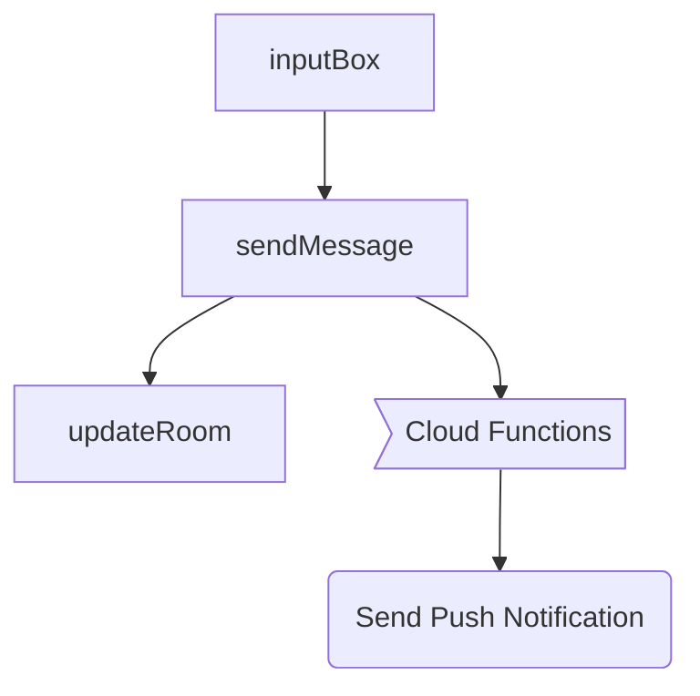
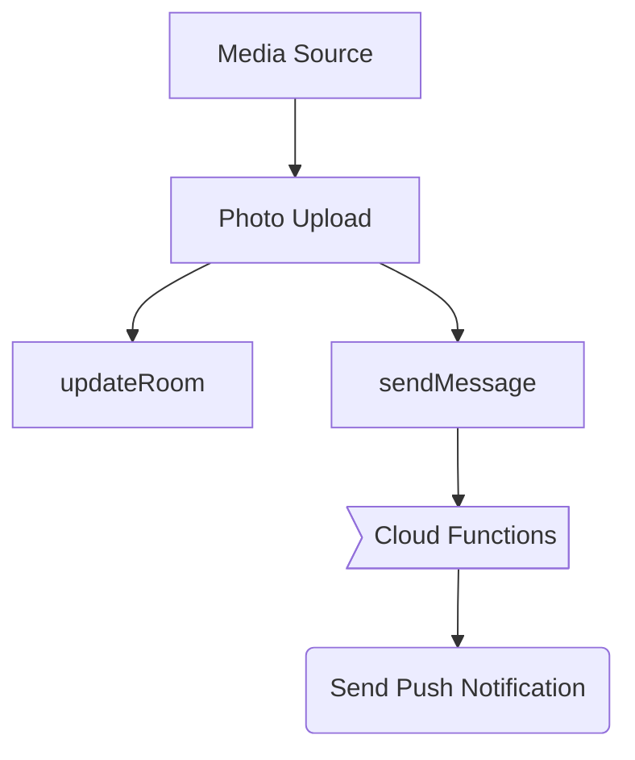

# Example App for Fireflutter

This project is an example app for demonstration of how to use Fireflutter.

## Navigation Diagram

This diagram will represent how the user may navigate the screens in the example app.

### Chat Message Send Flowchat

### Photo Send Flowchart

<!--
    TODO:
    Add more flowcharts
 -->
